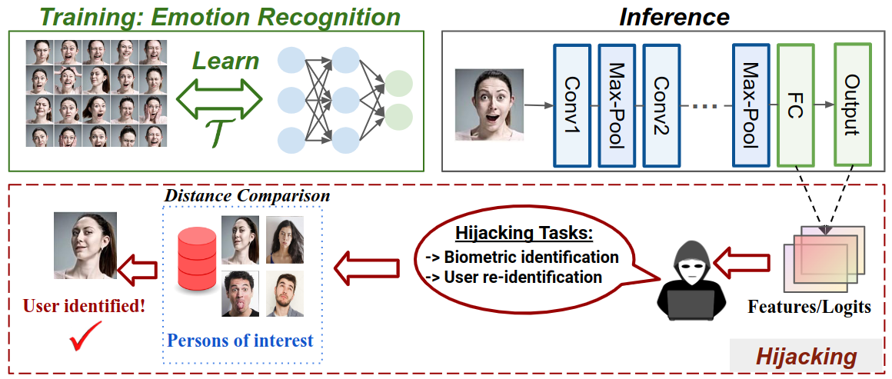

## Overview
This repository provides the official implementation of our SaTML 2025 paper "SnatchML: Hijacking ML Models without Training Access". In this paper, we investigate the threat of model hijacking in Machine Learning (ML) systems. Specifically, we demonstrate how an adversary can repurpose a pre-trained victim model to perform tasks different from its original objective—without requiring access to the model’s training process.



 # Paper and Supplementary

The arXiv version -> [here](https://arxiv.org/abs/2406.01708) for the full paper with additional results. Our paper has been accepted for publication in the the 3rd IEEE Conference on Secure and Trustworthy Machine Learning (SaTML 2025), Acceptance rate 29%.

## Features
- Implementation of the SnatchML hijacking attack method.
- Experimental setups and results for various hijacking scenarios.
- Datasets used for evaluation.

## Datasets:
- **CK+ Dataset**: Extended Cohn-Kanade dataset for emotion recognition.
- **Olivetti Faces**: Dataset for facial recognition.
- **Celebrity Dataset**: Facial images for various celebrities, augmented with emotion-specific images.
- **Synthetic Dataset**: Synthetic dataset generated using MakeHuman for emotion and identity recognition.
- **UTKFace Dataset**: Collection of facial images labeled with age, gender, and ethnicity.
- **Chest X-Ray Images (Pneumonia)**: Dataset containing X-ray images categorized into 'Pneumonia' and 'Normal' classes, further labeled into 'Viral' and 'Bacterial' subcategories.

## Datasets Preparation:
Download the datasets provided in the following Google Drive link and upload them to the './datasets' folder before running tany script.
- Link to the datasets: https://drive.google.com/drive/folders/1igivoksoUquXVbbV7W_B3Yjj3o4qpqzc?usp=sharing
- Link to ECG_ID dataset: https://drive.google.com/drive/folders/12xgCm6LlCIb8-Nd4X_Uk_H7o9lFKvQW0?usp=drive_link
- Link to MIT_BIH dataset: https://drive.google.com/drive/folders/1s3Y623HYllFOBaudPRnwaCJO5APWf5XV?usp=drive_link

## Hijacking ER Models:
To run the hijacking attack on ER models for re-identification on CK+ or biometric identification on Olivetti, Celebrity, and Synthetic datasets, run the following script by specifying in the argmenets: ER model architecture, hijacking dataset, and attack setting (white-box|black-box):
```shell
$ python hijack_er.py --setting [black|white] --model [architecture] --hijack-dataset [target hijacking dataset]
```

Example: For hijacking an ER model with MobileNet architecture for user identification on the Olivetti dataset under white-box setting:
```shell
$ python hijack_er.py --setting white --model mobilenet --hijack-dataset olivetti
```

## Hijacking PDD Models:
To run the hijacking attack on PDD models for recongnizing the type of the pneumonia infection (bacterial or viral) on the Chest X-ray dataset, run the following script by specifying in the argmenets: ER model architecture and attack setting (white-box|black-box):
```shell
$ python hijack_pneu.py --setting [black|white] --model [architecture]
```

Example: For hijacking a PDD model with ResNet-9 architecture for recognizing the pneumonia infection on the Chest X-ray dataset under black-box setting:
```shell
$ python hijack_penu.py --setting black --model resnet
```

## Cross-attribute Hijacking:
To run the hijacking attack on human attribute prediction models (e.g., for age, gender, and ethnicity) on the UTK dataset, run the following script by specifying: ER model architecture, original task, hijacking attack, and attack setting (white-box|black-box):
```shell
$ python hijack_utk.py --setting [black|white] --model [architecture] --original-task [original task] --hijack-task [Hijacking task]
```

Example: For hijacking an age estimation model with 2D-CNN architecture for ethnicity/race recognition on the UTK dataset under white-box setting:
```shell
$ python hijack_utk.py --setting white --model simple --original-task age --hijack-task race
```

## ECG Models hijacking:
All notebooks are available for ECG_to_id (folder: ecg_to_id) and ECG_2_to_5 (folder: ecg_2_to_5)

## Over-parametrized Models Study:
To reproduce our results on overparametrized models (Sections 9.1 and 10.2) of the paper, we provide automated scripts for each case as following (results will be auto-saved in ./results folder):
```shell
$ bash auto_test_er.sh $[hijacking dataset: ck, olivetti, celebrity, synthetic]
```

```shell
$ bash auto_test_pneu.sh
```

```shell
$ bash auto_test_utk.sh $[original task: age, gender, race] $[hijacking task: age, gender, race]
```

## Meta-unlearning experiments:
To reproduce our results on meta-unlearning models (Section 10.1) of the paper, run the following scripts for PDD and ER cases:
```shell
$ python unlearn_pneu.py --setting [black|white] --model [architecture] --alpha [0, 1] --beta [0, 1]
```

```shell
$ python unlearn_er.py --setting white --model mobilenet --hijack-dataset olivetti --alpha [0, 1] --beta [0, 1]
```

If you find this implementation helpful, please consider citing our work:

```BibTex
@article{ghorbel2024model,
  title={SnatchML: Hijacking ML Models without Training Access},
  author={Ghorbel, Mahmoud and Bouzidi, Halima and Bilasco, Ioan Marius and Alouani, Ihsen},
  journal={arXiv preprint arXiv:2406.01708},
  year={2025}
}